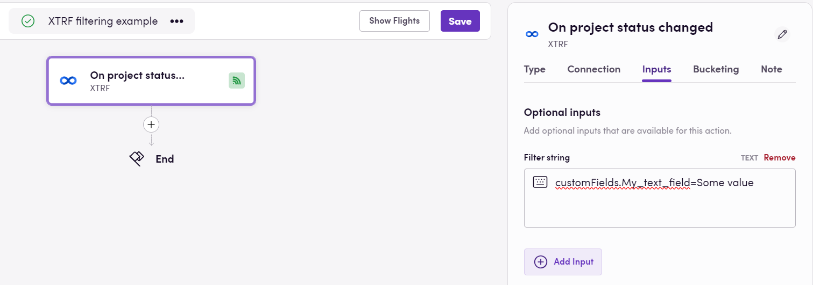

# Blackbird.io XTRF

Blackbird is the new automation backbone for the language technology industry. Blackbird provides enterprise-scale automation and orchestration with a simple no-code/low-code platform. Blackbird enables ambitious organizations to identify, vet and automate as many processes as possible. Not just localization workflows, but any business and IT process. This repository represents an application that is deployable on Blackbird and usable inside the workflow editor.

## Introduction

<!-- begin docs -->

XTRF is a comprehensive translation management system that streamlines and automates translation workflows for language service providers and corporate translation departments. It offers robust project management, collaboration, and automation features to enhance the efficiency of translation processes.

## Using filter strings in events

**On project status changed**, **On quote status changed** and **On customer updated** events have an optional parameter called _Filter string_, enabling result filtering based on custom fields. Please note the following:

- Currently, only text and single selection custom fields are supported for filtering. Complex filtering (such as AND, OR, NOT etc.) is not supported.
- Custom fields should be referenced by their keys with ".,()' characters and spaces changed to underscores. For instance, to reference _My text field_ you should use _customFields.My_text_field_.

For example, to trigger a bird on project status changes with the custom field _My text field_ set to _Some value_, select the **On project status changed** event in the bird editor. Then, choose the optional input _Filter string_ and enter _customFields.My_text_field=Some value_:

## Feedback

Do you want to use this app or do you have feedback on our implementation? Reach out to us using the [established channels](https://www.blackbird.io/) or create an issue.

<!-- end docs -->
